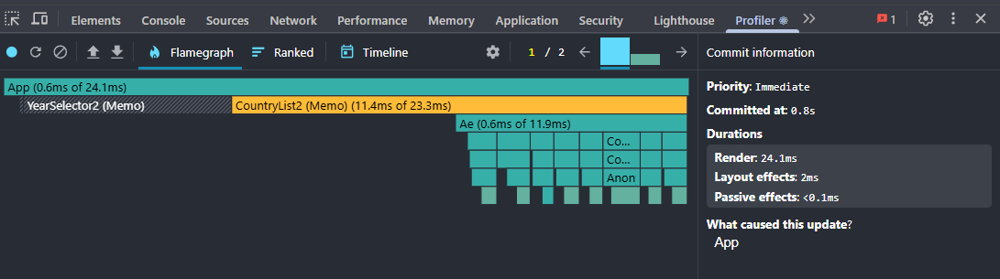
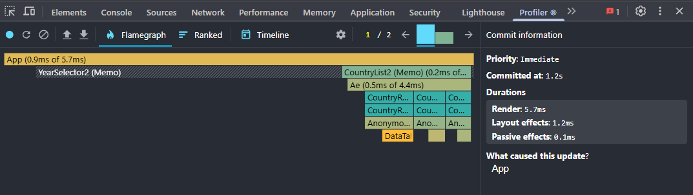
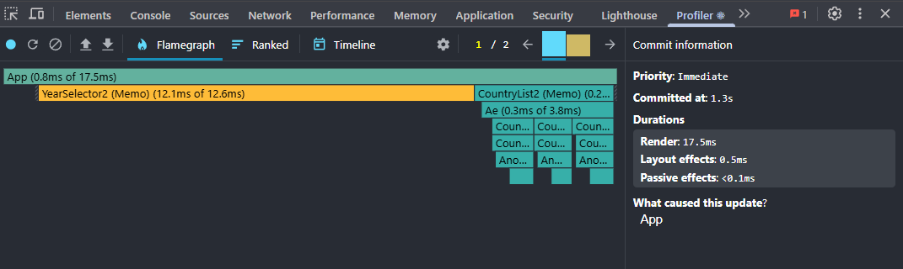
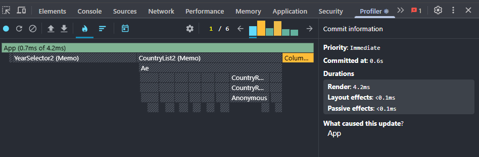

# Performance Optimization Report

## Baseline Measurements

### Interaction A: Sort countries

- **Commit duration**: 1.5 s
- **Render duration**: 261.7 ms
- **Screenshot**: 

### Interaction B: Search countries

- **Commit duration**: 2.8 s
- **Render duration**: 123.1 ms
- **Screenshot**: 

### Interaction C: Change year

- **Commit duration**: 1.8 s
- **Render duration**: 232.7 ms
- **Screenshot**: 

### Interaction D: Toggle column

- **Commit duration**: 1.1 s
- **Render duration**: 221 ms
- **Screenshot**: 

## Optimized Measurements

### Interaction A: Sort countries

- **Commit duration**: 0.8 s
- **Render duration**: 24.1 ms
- **Screenshot**: 

### Interaction B: Search countries

- **Commit duration**: 1.2 s
- **Render duration**: 5.7 ms
- **Screenshot**: 

### Interaction C: Change year

- **Commit duration**: 1.3 s
- **Render duration**: 17.5 ms
- **Screenshot**: 

### Interaction D: Toggle column

- **Commit duration**: 0.6 s
- **Render duration**: 4.2 ms
- **Screenshot**: 

## Summary of Improvements

| Interaction      | Baseline (ms) | Optimized (ms) | Improvement |
| ---------------- | ------------- | -------------- | ----------- |
| Sort countries   | 261.7         | 24.1           | 90%         |
| Search countries | 123.1         | 5.7            | 95%         |
| Change year      | 232.7         | 17.5           | 92%         |
| Toggle column    | 221           | 4.2            | 98%         |
| **Average**      | 209.6         | 12.8           | 93%         |